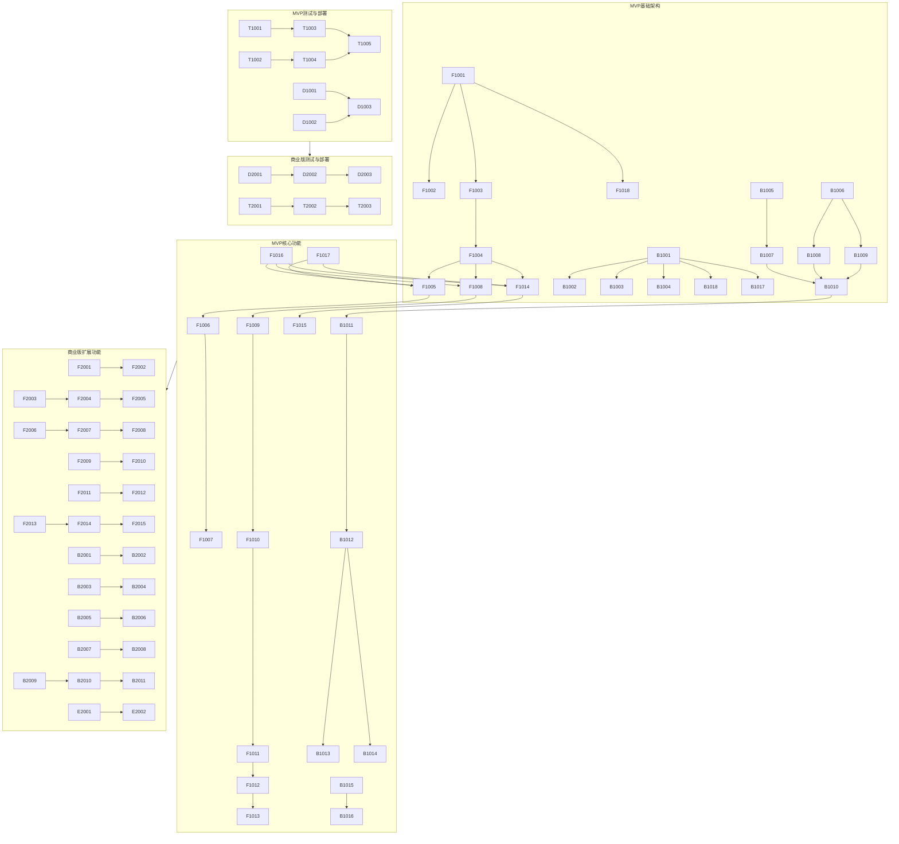

# AI会议助手任务分解文档

## 1. 文档概述

本文档基于AI会议助手的模块设计，对开发任务进行细粒度原子化分解，明确第1期MVP和第2期迭代2商业版的任务范围、优先级和交付标准，为开发团队提供清晰的任务执行依据。

## 2. 任务分解原则

- **原子化**：每个任务只负责一个特定功能点，便于独立开发和测试
- **优先级驱动**：按功能重要性和依赖关系确定优先级
- **MVP聚焦**：第1期MVP只包含核心功能，满足基本用户需求
- **迭代扩展**：第2期商业版在MVP基础上扩展功能，增强商业价值
- **可追踪**：每个任务有唯一ID，便于进度跟踪和责任明确

## 3. 第1期 MVP 任务分解

### 3.1 前端模块任务

| 任务ID | 任务名称 | 模块分类 | 技术栈 | 任务描述 | 交付物 | 优先级 | 估计工作量 | 负责人 | 状态 |
|--------|----------|----------|--------|----------|--------|--------|------------|--------|------|
| F1001 | 初始化Vue 3项目 | 基础框架模块 | Vue 3, Vite, TypeScript | 使用Vite创建Vue 3 + TypeScript项目 | 初始化的项目结构 | P0 | 4h | 前端开发 | 待开始 |
| F1002 | 配置ESLint和Prettier | 基础框架模块 | ESLint, Prettier | 配置代码检查和格式化规则 | 配置文件 | P1 | 2h | 前端开发 | 待开始 |
| F1003 | 搭建路由架构 | 路由管理模块 | Vue Router | 配置基础路由结构，包括主页面路由 | 路由配置文件 | P0 | 3h | 前端开发 | 待开始 |
| F1004 | 搭建Pinia状态管理 | 状态管理模块 | Pinia | 配置Pinia，创建基础状态存储 | 状态管理配置 | P0 | 3h | 前端开发 | 待开始 |
| F1005 | 实现会话创建功能 | 会话管理模块 | Vue 3 | 实现会话创建UI和逻辑 | 会话创建组件 | P0 | 5h | 前端开发 | 待开始 |
| F1006 | 实现会话结束功能 | 会话管理模块 | Vue 3 | 实现会话结束UI和逻辑 | 会话结束组件 | P0 | 4h | 前端开发 | 待开始 |
| F1007 | 实现会话状态显示 | 会话管理模块 | Vue 3 | 显示当前会话状态（活跃/结束） | 会话状态组件 | P1 | 3h | 前端开发 | 待开始 |
| F1008 | 实现麦克风权限请求 | 录音转写模块 | Web API | 请求和管理麦克风权限 | 麦克风权限组件 | P0 | 4h | 前端开发 | 待开始 |
| F1009 | 实现实时音频捕获 | 录音转写模块 | Web API | 捕获设备麦克风音频流 | 音频捕获服务 | P0 | 5h | 前端开发 | 待开始 |
| F1010 | 实现WebSocket连接 | WebSocket模块 | WebSocket API | 建立与后端的WebSocket连接 | WebSocket服务 | P0 | 4h | 前端开发 | 待开始 |
| F1011 | 实现语音转写调用 | 录音转写模块 | WebSocket | 通过WebSocket发送音频流到后端 | 语音转写服务 | P0 | 5h | 前端开发 | 待开始 |
| F1012 | 实现实时转写展示 | 转写展示模块 | Vue 3 | 实时显示转写结果，自动滚动 | 转写展示组件 | P0 | 6h | 前端开发 | 待开始 |
| F1013 | 实现发言者色彩区分 | 转写展示模块 | Vue 3 | 为不同发言者分配不同颜色 | 发言者色彩组件 | P1 | 3h | 前端开发 | 待开始 |
| F1014 | 实现AI分析触发 | AI分析模块 | Vue 3 | 实现点击发言生成AI分析的功能 | AI分析触发组件 | P0 | 4h | 前端开发 | 待开始 |
| F1015 | 实现AI分析结果展示 | AI分析模块 | Vue 3 | 展示AI生成的分析结果 | AI分析展示组件 | P0 | 5h | 前端开发 | 待开始 |
| F1016 | 实现基础UI组件 | UI组件模块 | Element Plus | 引入和配置Element Plus，实现基础UI组件 | UI组件配置 | P1 | 6h | 前端开发 | 待开始 |
| F1017 | 实现API请求封装 | API请求模块 | Axios | 封装Axios请求，处理错误和拦截器 | API服务 | P0 | 4h | 前端开发 | 待开始 |
| F1018 | 实现基础样式 | 基础框架模块 | CSS, Element Plus | 实现应用的基础样式和主题 | 样式文件 | P1 | 5h | 前端开发 | 待开始 |

### 3.2 后端模块任务

| 任务ID | 任务名称 | 模块分类 | 技术栈 | 任务描述 | 交付物 | 优先级 | 估计工作量 | 负责人 | 状态 |
|--------|----------|----------|--------|----------|--------|--------|------------|--------|------|
| B1001 | 初始化NestJS项目 | 基础架构模块 | NestJS, TypeScript | 创建NestJS + TypeScript项目 | 初始化的项目结构 | P0 | 4h | 后端开发 | 待开始 |
| B1002 | 配置全局日志 | 基础架构模块 | Winston | 配置Winston日志，记录请求和错误 | 日志配置 | P1 | 3h | 后端开发 | 待开始 |
| B1003 | 配置全局异常过滤器 | 基础架构模块 | NestJS | 实现全局异常处理，统一返回格式 | 异常过滤器 | P1 | 3h | 后端开发 | 待开始 |
| B1004 | 配置数据验证管道 | 基础架构模块 | Class Validator | 实现数据验证，确保请求数据合法性 | 验证管道 | P1 | 3h | 后端开发 | 待开始 |
| B1005 | 配置PostgreSQL连接 | 数据存储模块 | Prisma, PostgreSQL | 配置Prisma连接PostgreSQL数据库 | 数据库连接配置 | P0 | 4h | 后端开发 | 待开始 |
| B1006 | 配置MongoDB连接 | 数据存储模块 | Mongoose, MongoDB | 配置Mongoose连接MongoDB数据库 | MongoDB连接配置 | P0 | 4h | 后端开发 | 待开始 |
| B1007 | 设计会话数据模型 | 数据模型模块 | Prisma | 设计会话表结构和关系 | 会话模型文件 | P0 | 3h | 后端开发 | 待开始 |
| B1008 | 设计发言记录数据模型 | 数据模型模块 | Mongoose | 设计发言记录集合结构 | 发言记录模型文件 | P0 | 3h | 后端开发 | 待开始 |
| B1009 | 设计AI分析数据模型 | 数据模型模块 | Mongoose | 设计AI分析结果集合结构 | AI分析模型文件 | P0 | 3h | 后端开发 | 待开始 |
| B1010 | 实现会话管理API | 会话管理模块 | NestJS | 实现会话创建、结束和查询API | 会话控制器和服务 | P0 | 6h | 后端开发 | 待开始 |
| B1011 | 实现WebSocket网关 | WebSocket模块 | NestJS WebSocket | 实现WebSocket网关，处理实时通信 | WebSocket网关 | P0 | 5h | 后端开发 | 待开始 |
| B1012 | 实现语音转写处理 | 语音处理模块 | Axios | 接收音频流，调用语音识别API | 语音处理服务 | P0 | 6h | 后端开发 | 待开始 |
| B1013 | 集成豆包流语音识别 | 外部服务模块 | Axios | 集成豆包流语音识别模型2.0 | 语音识别客户端 | P0 | 5h | 后端开发 | 待开始 |
| B1014 | 实现基础发言者识别 | 语音处理模块 | Machine Learning | 实现基础的发言者识别功能 | 发言者识别服务 | P1 | 6h | 后端开发 | 待开始 |
| B1015 | 实现AI分析服务 | AI服务模块 | NestJS | 实现AI分析请求处理逻辑 | AI分析服务 | P0 | 5h | 后端开发 | 待开始 |
| B1016 | 集成千问AI模型 | 外部服务模块 | Axios | 集成千问AI模型API | 千问模型客户端 | P0 | 4h | 后端开发 | 待开始 |
| B1017 | 实现API文档 | API文档模块 | Swagger | 配置Swagger，生成API文档 | API文档 | P1 | 3h | 后端开发 | 待开始 |
| B1018 | 配置CORS中间件 | 中间件模块 | NestJS | 配置CORS，允许前端跨域请求 | CORS配置 | P0 | 2h | 后端开发 | 待开始 |

### 3.3 部署与测试模块任务

| 任务ID | 任务名称 | 模块分类 | 技术栈 | 任务描述 | 交付物 | 优先级 | 估计工作量 | 负责人 | 状态 |
|--------|----------|----------|--------|----------|--------|--------|------------|--------|------|
| D1001 | 编写Dockerfile（前端） | Docker模块 | Docker | 编写前端应用的Dockerfile | 前端Dockerfile | P1 | 2h | DevOps | 待开始 |
| D1002 | 编写Dockerfile（后端） | Docker模块 | Docker | 编写后端应用的Dockerfile | 后端Dockerfile | P1 | 2h | DevOps | 待开始 |
| D1003 | 编写Docker Compose配置 | Docker模块 | Docker Compose | 编写Docker Compose配置文件 | docker-compose.yml | P1 | 3h | DevOps | 待开始 |
| T1001 | 编写前端单元测试 | 前端测试模块 | Vitest | 为前端组件编写单元测试 | 单元测试用例 | P1 | 8h | 测试工程师 | 待开始 |
| T1002 | 编写后端单元测试 | 后端测试模块 | Jest | 为后端服务编写单元测试 | 单元测试用例 | P1 | 8h | 测试工程师 | 待开始 |
| T1003 | 编写集成测试 | 前端测试模块 | Vitest | 编写前端集成测试 | 集成测试用例 | P2 | 6h | 测试工程师 | 待开始 |
| T1004 | 编写API测试 | 后端测试模块 | Supertest | 编写API接口测试 | API测试用例 | P1 | 6h | 测试工程师 | 待开始 |
| T1005 | 手动测试核心功能 | 测试模块 | 浏览器 | 手动测试MVP核心功能 | 测试报告 | P0 | 8h | 测试工程师 | 待开始 |

## 4. 第2期迭代 2 商业版任务分解

### 4.1 前端模块任务

| 任务ID | 任务名称 | 模块分类 | 技术栈 | 任务描述 | 交付物 | 优先级 | 估计工作量 | 负责人 | 状态 |
|--------|----------|----------|--------|----------|--------|--------|------------|--------|------|
| F2001 | 实现会话列表功能 | 会话管理模块 | Vue 3 | 实现历史会话列表展示 | 会话列表组件 | P1 | 5h | 前端开发 | 待开始 |
| F2002 | 实现会话详情功能 | 会话管理模块 | Vue 3 | 实现会话详情查看功能 | 会话详情组件 | P1 | 5h | 前端开发 | 待开始 |
| F2003 | 实现发言编辑功能 | 发言管理模块 | Vue 3 | 支持手动编辑发言内容 | 发言编辑组件 | P1 | 4h | 前端开发 | 待开始 |
| F2004 | 实现发言搜索功能 | 发言管理模块 | Vue 3 | 实现按关键词搜索发言 | 发言搜索组件 | P2 | 5h | 前端开发 | 待开始 |
| F2005 | 实现发言标记功能 | 发言管理模块 | Vue 3 | 支持标记重要发言 | 发言标记组件 | P2 | 3h | 前端开发 | 待开始 |
| F2006 | 实现AI模型切换 | AI分析模块 | Vue 3 | 支持切换不同AI模型 | 模型切换组件 | P1 | 4h | 前端开发 | 待开始 |
| F2007 | 实现分析类型切换 | AI分析模块 | Vue 3 | 支持切换分析类型（核心要点/简要回答/深度分析） | 分析类型切换组件 | P1 | 3h | 前端开发 | 待开始 |
| F2008 | 实现分析结果导出 | AI分析模块 | Vue 3 | 支持导出AI分析结果 | 导出功能组件 | P1 | 4h | 前端开发 | 待开始 |
| F2009 | 实现转写置信度显示 | 转写展示模块 | Vue 3 | 可选择显示转写置信度 | 置信度显示组件 | P2 | 3h | 前端开发 | 待开始 |
| F2010 | 实现移动端适配 | 基础框架模块 | CSS, Element Plus | 实现响应式设计，适配移动端 | 移动端样式 | P1 | 6h | 前端开发 | 待开始 |
| F2011 | 实现深色主题支持 | UI组件模块 | Element Plus | 支持切换浅色/深色主题 | 主题切换组件 | P2 | 4h | 前端开发 | 待开始 |
| F2012 | 实现设置页面 | 状态管理模块 | Vue 3 | 实现应用设置页面 | 设置组件 | P2 | 5h | 前端开发 | 待开始 |
| F2013 | 实现本地存储 | 工具函数模块 | Web API | 实现本地数据存储，支持离线使用 | 本地存储服务 | P1 | 5h | 前端开发 | 待开始 |
| F2014 | 实现自动保存 | 状态管理模块 | Vue 3 | 实现数据自动保存功能 | 自动保存服务 | P1 | 4h | 前端开发 | 待开始 |
| F2015 | 实现加载状态优化 | UI组件模块 | Element Plus | 优化加载状态显示，提升用户体验 | 加载状态组件 | P2 | 3h | 前端开发 | 待开始 |

### 4.2 后端模块任务

| 任务ID | 任务名称 | 模块分类 | 技术栈 | 任务描述 | 交付物 | 优先级 | 估计工作量 | 负责人 | 状态 |
|--------|----------|----------|--------|----------|--------|--------|------------|--------|------|
| B2001 | 集成更多AI模型 | AI服务模块 | Axios | 集成doubao, GLM, MINIMAX, KIMI, DC模型 | 多模型客户端 | P1 | 12h | 后端开发 | 待开始 |
| B2002 | 实现AI模型管理 | AI服务模块 | NestJS | 实现AI模型配置和管理功能 | 模型管理服务 | P1 | 5h | 后端开发 | 待开始 |
| B2003 | 实现高级发言者识别 | 语音处理模块 | Machine Learning | 优化发言者识别算法 | 高级发言者识别服务 | P1 | 8h | 后端开发 | 待开始 |
| B2004 | 实现音频预处理 | 语音处理模块 | FFmpeg | 实现音频降噪和增强处理 | 音频预处理服务 | P2 | 6h | 后端开发 | 待开始 |
| B2005 | 实现批量AI分析 | AI服务模块 | NestJS | 支持对多条发言进行批量分析 | 批量分析服务 | P2 | 5h | 后端开发 | 待开始 |
| B2006 | 实现数据导出API | 发言管理模块 | NestJS | 实现发言和分析结果导出API | 导出API | P1 | 4h | 后端开发 | 待开始 |
| B2007 | 实现JWT认证 | 认证授权模块 | Passport JWT | 实现基于JWT的身份认证 | JWT认证模块 | P1 | 6h | 后端开发 | 待开始 |
| B2008 | 实现请求速率限制 | 中间件模块 | NestJS | 实现API请求速率限制 | 速率限制中间件 | P2 | 3h | 后端开发 | 待开始 |
| B2009 | 实现高级日志 | 基础架构模块 | Winston | 实现更详细的日志记录和分析 | 高级日志配置 | P2 | 4h | 后端开发 | 待开始 |
| B2010 | 实现Redis缓存 | 数据存储模块 | Redis | 实现Redis缓存，提高性能 | Redis缓存服务 | P2 | 5h | 后端开发 | 待开始 |
| B2011 | 实现RabbitMQ集成 | 基础架构模块 | RabbitMQ | 集成RabbitMQ，处理异步任务 | RabbitMQ配置 | P2 | 6h | 后端开发 | 待开始 |

### 4.3 外部服务模块任务

| 任务ID | 任务名称 | 模块分类 | 技术栈 | 任务描述 | 交付物 | 优先级 | 估计工作量 | 负责人 | 状态 |
|--------|----------|----------|--------|----------|--------|--------|------------|--------|------|
| E2001 | 集成多语音识别服务 | 外部服务模块 | Axios | 集成百度、讯飞等语音识别服务作为备选 | 多语音识别客户端 | P2 | 8h | 后端开发 | 待开始 |
| E2002 | 实现AI服务降级策略 | 外部服务模块 | TypeScript | 实现AI服务降级和重试机制 | 服务降级组件 | P1 | 4h | 后端开发 | 待开始 |

### 4.4 部署与测试模块任务

| 任务ID | 任务名称 | 模块分类 | 技术栈 | 任务描述 | 交付物 | 优先级 | 估计工作量 | 负责人 | 状态 |
|--------|----------|----------|--------|----------|--------|--------|------------|--------|------|
| D2001 | 优化Docker配置 | Docker模块 | Docker | 优化Docker镜像，减小体积，提高性能 | 优化后的Docker配置 | P2 | 4h | DevOps | 待开始 |
| D2002 | 实现CI/CD流水线 | CI/CD模块 | GitHub Actions | 实现自动化构建、测试和部署流水线 | CI/CD配置 | P1 | 6h | DevOps | 待开始 |
| D2003 | 实现监控集成 | 监控模块 | Prometheus, Grafana | 集成Prometheus和Grafana监控 | 监控配置 | P2 | 5h | DevOps | 待开始 |
| T2001 | 编写端到端测试 | 前端测试模块 | Cypress | 编写端到端测试用例 | E2E测试用例 | P1 | 8h | 测试工程师 | 待开始 |
| T2002 | 编写性能测试 | 后端测试模块 | JMeter | 编写API性能测试用例 | 性能测试报告 | P2 | 6h | 测试工程师 | 待开始 |
| T2003 | 进行兼容性测试 | 测试模块 | 多浏览器 | 测试在不同浏览器和设备上的兼容性 | 兼容性测试报告 | P1 | 8h | 测试工程师 | 待开始 |

## 5. 任务关系图

## 6. 交付标准

### 6.1 代码交付标准
- 代码符合ESLint和Prettier规范
- 代码覆盖率：单元测试≥80%，集成测试≥70%
- 代码提交遵循Conventional Commits规范
- 提供详细的代码注释和文档

### 6.2 功能交付标准
- 所有P0和P1优先级任务完成
- 核心功能通过手动测试和自动化测试
- 无严重bug和性能问题
- 提供功能演示视频

### 6.3 文档交付标准
- 完整的API文档
- 详细的部署文档
- 功能使用说明
- 测试报告

## 7. 更新日志

| 更新日期 | 更新内容 | 更新人 |
|----------|----------|--------|
| 2026-01-09 | 初始创建任务分解文档 | AI助手 |
