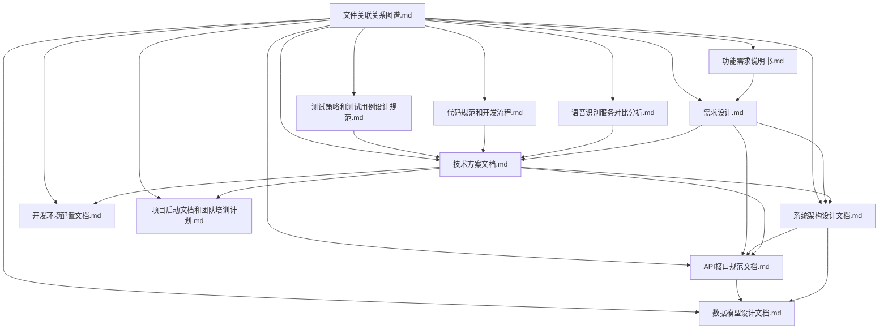

# AI会议助手文件关联关系图谱

## 1. 文档概述

本文档展示了AI会议助手项目中各个文档之间的关系和依赖，帮助团队成员理解项目文档的整体结构和相互关联。

## 2. 文件关系图谱

## 3. 文档依赖关系说明

| 文档名称 | 依赖文档 | 关系说明 |
|----------|----------|----------|
| 技术方案文档.md | 需求设计.md, 语音识别服务对比分析.md, 功能需求说明书.md | 基于需求和语音识别对比结果制定技术方案 |
| 系统架构设计文档.md | 技术方案文档.md, 需求设计.md | 基于技术方案和需求设计系统架构 |
| API接口规范文档.md | 技术方案文档.md, 系统架构设计文档.md, 需求设计.md | 基于技术方案和架构设计API接口 |
| 数据模型设计文档.md | 系统架构设计文档.md, API接口规范文档.md | 基于架构和API设计数据模型 |
| 开发环境配置文档.md | 技术方案文档.md | 基于技术方案配置开发环境 |
| 项目启动文档和团队培训计划.md | 技术方案文档.md | 基于技术方案制定启动计划和培训内容 |
| 需求设计.md | 功能需求说明书.md | 基于功能需求进行UI/UX设计 |
| 语音识别服务对比分析.md | 功能需求说明书.md | 为满足需求进行语音识别服务对比 |
| 代码规范和开发流程.md | 技术方案文档.md | 基于技术方案制定代码规范和开发流程 |
| 测试策略和测试用例设计规范.md | 技术方案文档.md | 基于技术方案制定测试策略和用例 |
| 文件关联关系图谱.md | 所有文档 | 展示所有文档之间的关系 |

## 4. 文档作用分类

### 4.1 核心规划文档
- 技术方案文档.md：项目技术总体方案
- 系统架构设计文档.md：系统架构详细设计
- 需求设计.md：UI/UX设计和功能需求

### 4.2 接口与数据文档
- API接口规范文档.md：API接口设计规范
- 数据模型设计文档.md：数据模型设计

### 4.3 环境与配置文档
- 开发环境配置文档.md：开发环境配置指南
- 代码规范和开发流程.md：代码规范和开发流程

### 4.4 项目管理文档
- 项目启动文档和团队培训计划.md：项目启动和培训计划
- 测试策略和测试用例设计规范.md：测试策略和用例设计

### 4.5 辅助分析文档
- 语音识别服务对比分析.md：语音识别服务对比
- 功能需求说明书.md：功能需求详细说明
- 文件关联关系图谱.md：文档关系图谱

## 5. 更新日志

| 更新日期 | 更新内容 | 更新人 |
|----------|----------|--------|
| 2026-01-09 | 初始创建文件关联关系图谱 | AI助手 |
